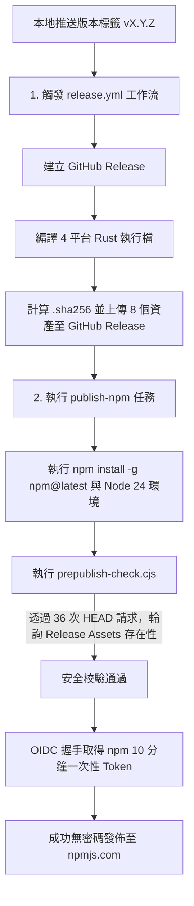

# NPM OIDC 信任發佈與 Rust CLI 包裝整合技能 (NPM OIDC Publish & Rust Wrapper Skill)

本技能 (Skill) 專為 `subembed` 專案（一個包裝 Rust CLI 的輕量級 npm 套件）設計，用於指導與執行基於 GitHub Actions、OIDC 信任發佈 (Trusted Publishing) 的全自動二進位檔編譯與 npm 套件無密碼安全發佈。

---

## 🎯 適用場景與觸發時機

當需要進行以下操作時，AI Agent 應立刻調用此技能：
1. **升級版本並準備發佈新版本**（例如從 `0.1.1` 升級到 `0.1.2`）。
2. **排查與修復 npm 發佈工作流 (CI/CD)**。
3. **優化 GitHub Actions 執行效率或編譯速度**。
4. **解決 OIDC（OpenID Connect）驗證或 TLS 握手失敗**。

---

## 🏗️ 核心架構與生命週期 (Architecture & Lifecycle)

`subembed` 的核心特色是**輕量化的包裝套件**，其 npm 套件本身不含厚重的編譯代碼，而是透過 `postinstall` 腳本向 GitHub Release 下載對應作業系統的預編譯 Rust 二進位檔案。

因此，發佈時存在**強烈的雙向依賴關係**：
- **發佈 npm時**，必須確保 GitHub Release 上的 4 平台執行檔已被編譯並成功上傳，否則 `prepublishOnly` 的安全檢查腳本（`prepublish-check.cjs`）會失敗，拒絕發佈，防止發佈一個損壞的 npm 套件。
- **安裝 npm 時**，不需再透過 Rust toolchain 本地編譯，大幅提升使用者的安裝速度與相容性。

### 1. 全自動發佈拓撲圖 (Automation Topology)



---

## ⚡ 實戰踩坑紀錄與終極優化 (Lessons Learned & Optimizations)

在建置此專案的 CI/CD 過程中，我們踩過了兩大深坑，並成功實施了頂級的工程優化。未來遇到類似錯誤時，**必須以此最優方案為基準進行診斷**：

### 🚨 痛點一：NPM OIDC 握手失敗與誤導性的 404 錯誤

* **異常狀況**：
  在 GitHub Actions 執行 `npm publish --provenance`時，頻繁出現以下錯誤：
  ```bash
  npm error 404 Not Found - PUT https://registry.npmjs.org/subembed - Not found
  ```
  > [!WARNING]
  > 這是一個極具誤導性的錯誤！它指涉套件 `subembed` 在 npmjs.com 找不到（或命名空間被鎖），但實際上**是因為舊版 npm CLI 的 OIDC 安全協議握手失敗**，導致 npm 註冊表直接中斷連線，最終回傳 404 狀態碼。
* **最佳實踐與解決方案**：
  1. 將工作流中的 Node.js 升級至 **`Node.js 24`**。
  2. 在發佈之前，必須強制全域更新 npm CLI：
     ```yaml
     - name: Upgrade npm
       run: npm install -g npm@latest
     ```
     這樣做能確保使用最安全的 TLS 與 OIDC 客戶端代碼進行憑證交握。

### 🚨 痛點二：macos-13 實體伺服器停用導致佇列卡住

* **異常狀況**：
  原先 `release.yml` 在編譯 `x86_64-apple-darwin` (Intel Mac) 執行檔時，使用的是 `runs-on: macos-13`。由於 GitHub 政策調整，`macos-13` runner 極度短缺，導致任務時常卡在 `Starting...` 或 `Queued` 超過 15~30 分鐘，嚴重損害 CI 敏捷度。
* **最佳實踐與解決方案**：
  統一升級為 **`macos-14` (Apple Silicon 實體機器)**。
  利用 Rust 強大的跨平台交叉編譯（Cross-compilation）能力，在 Apple Silicon 機器上原生編譯出支援 Intel 處理器的二進位檔：
  ```yaml
  - runner: macos-14
    target: x86_64-apple-darwin
  ```
  * **優化成果**：佇列等待時間降到 **0 秒**；Intel Mac 編譯上傳在 **59 秒** 內完成，速度提升 15 倍以上！

---

## 🛠️ 首次發佈「冷啟動」指南 (First-Time Cold Start Guide)

> [!IMPORTANT]
> **「雞生蛋、蛋生雞」難題：**
> 在尚未將套件首次手動發佈至 npmjs.com 之前，您無法在 npm 後台為此套件設定 OIDC Trusted Publishing。
> 同時，若您直接用 CI 自動發佈，因為此時還沒有 OIDC 權限，發佈必然會被 npm 拒絕。

因此，首次發佈必須遵循以下三階段「冷啟動」流程：

### 第一階段：全自動跳過 OIDC 的 Release 建立
當您本地推送第一個 Tag `v0.1.0` 時，`.github/workflows/release.yml` 中配置了**智慧控制參數 (Trigger Parameters)**。
在 `Publish package` 步驟中：
```yaml
if: ${{ !startsWith(github.ref_name, 'v0.1.0') }}
```
* **運作機制**：偵測到 Tag 名稱為 `v0.1.0` 開頭時，自動發佈流程會**全自動安全跳過**，只建立 GitHub Release 並上傳二進位檔案，而不嘗試向 npm 發佈。

### 第二階段：本地首次手動發佈
當第一階段自動上傳 4 平台二進位檔至 GitHub Release 成功後，您可以在本地進行首次手動發佈：
1. **登入您的個人 npm 帳號**：
   ```bash
   npm login
   ```
2. **手動執行發佈**：
   ```bash
   npm publish
   ```
   *註：此時本地的 `prepublishOnly` 會執行 `prepublish-check.cjs`。由於第一階段的資產已存在於 GitHub Release，檢查會順利通過！*

### 第三階段：設定 Trusted Publishing 與驗證後續發佈
1. 進入 [npmjs.com/package/subembed](https://www.npmjs.com/package/subembed)。
2. 進入 **Settings > Publishing > Trusted Publishing**。
3. 新增 GitHub Publisher：
   - **GitHub Owner**: `doggy8088` (或您的組織帳號)
   - **Repository**: `subembed`
   - **Workflow Name**: `release.yml`
   - **Environment**: *(留空)*
4. **驗證全自動發佈**：
   - 將 `package.json` 的版本升級至 `0.1.1`（或更新版本）。
   - 推送新 tag `v0.1.1`：
     ```bash
     git tag v0.1.1
     git push origin v0.1.1
     ```
   - 此時，`release.yml` 會全自動編譯上傳資產，接著透過 OIDC **全自動完成 100% 免密碼的 npm 安全發佈**！

---

## 📋 後續版本發佈標準流程 (Standard Release Runbook)

當專案已經完成「冷啟動」，後續發佈新版本（如 `0.1.2`）時，只需執行以下**零配置步驟**：

1. **更新專案版本與日誌**：
   - 在 `package.json` 中，將 `"version"` 修改為 `"0.1.2"`。
   - 在 `CHANGELOG.md` 中紀錄變更。
2. **提交並推送到主分支**：
   ```bash
   git add package.json CHANGELOG.md
   git commit -m "chore: bump version to 0.1.2"
   git push origin main
   ```
3. **推送版本 Tag 觸發全自動 CI**：
   ```bash
   git tag v0.1.2
   git push origin v0.1.2
   ```
4. **監控 GitHub Actions**：
   - `Release`工作流會自動開始編譯。
   - 待編譯完成後，`Publish npm` 將被觸發，透過 OIDC 全自動、無痛地將新版本釋出到 npmjs.com。

---

## 🔍 常見排查與手動干預 (Troubleshooting)

### 1. GitHub Actions 已成功釋出 Release，但 npm 發佈卡住或超時
* **原因**：可能 GitHub Release 的資產上傳較慢，超過了 `prepublish-check.cjs` 的等待極限。
* **解決方案**：
  進入 GitHub Actions 的 `Publish npm` 工作流頁面，點選 **Run workflow**。勾選或不勾選 `skip_publish`，此處可以手動觸發再次執行 `Publish npm`。

### 2. 在 GitHub Release 內文控制不發佈
* **情境**：在發佈正式 GitHub Release 時，希望「暫時不要」自動發佈至 npm。
* **解決方案**：
  在建立或編輯 GitHub Release 時，在 Release Body (說明內文) 的任何地方，寫入 `[skip npm]` 關鍵字。發佈工作流偵測到此字眼後，將會優雅地安全跳過 npm 發佈步驟。

---

> [!NOTE]
> 本 Skill 定義了 `subembed` 專案高安全、極速編譯的發佈基石。未來不論是更換 CI 伺服器或調整部署，皆應嚴格遵循 OIDC 無密碼安全性規範。
