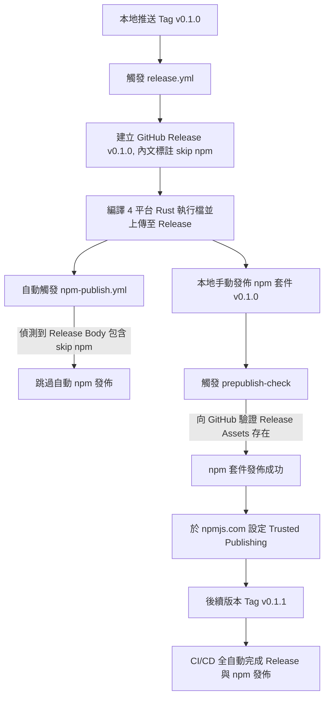

# subembed 首次發佈與 CI/CD 部署指南

本指南詳細規劃了 `subembed` 套件的首次發佈流程。由於本專案是一個**包裝 Rust CLI 的輕量級 npm 套件**，其安裝機制（`postinstall`）與發佈前檢查（`prepublish-check`）深度依賴 **GitHub Releases 上的預編譯二進位檔 (Binaries)**。

本專案已採用**參數控制（Trigger Parameters）**技術，讓您在首次發佈時**完全不需要修改任何 workflow 程式碼、亦不產生多餘的 Commit**，即可優雅控制首次發佈。

---

## 核心設計邏輯與生命週期

在開始前，您必須了解本專案的發佈鏈結關係：



> [!IMPORTANT]
> **為什麼不能一開始就用 CI 自動發佈 npm？**
> 1. **搶先佔有命名空間**：`subembed` 必須先在 npmjs.com 上被建立出來，才能針對該套件設定 OIDC Trusted Publishing。
> 2. **雙向相依性限制**：npm 的 `prepublishOnly` 會執行 `prepublish-check.cjs`。該腳本會透過 HTTP HEAD 請求驗證 GitHub Release 是否已有對應版本的二進位檔案。如果 GitHub Release 還沒產生（或是 Repo 還是 Private），`prepublish` 檢查會失敗，導致無法發佈。

---

## 🚀 首次發佈完整步驟

### 第一階段：建立 Public GitHub 儲存庫

1. **建立 GitHub 儲存庫**：
   在 GitHub 上建立一個名為 `subembed` 的全新儲存庫。
   > [!WARNING]
   > 儲存庫**必須設定為 Public (公開)**。如果是 Private，未授權的 npm 使用者在執行 `npm install` 時，將因無法存取 GitHub Release 下載點而導致 `postinstall` 失敗。

2. **關聯遠端並推送代碼**：
   在本地專案目錄下執行以下指令：
   ```bash
   git init
   git add .
   git commit -m "feat: initial commit"
   git branch -M main
   git remote add origin git@github.com:doggy8088/subembed.git
   git push -u origin main
   ```

---

### 第二階段：觸發第一次 CI 並建立 Release (使用參數跳過自動 npm 發佈)

我們在 `.github/workflows/npm-publish.yml` 中設計了**雙重參數過濾器**：
- **手動觸發時**：可以勾選或傳入 `skip_publish: true` 參數。
- **自動觸發時（GitHub Release）**：只要 Release 的內容中包含 `[skip npm]` 關鍵字，自動發佈流程就會安全跳過！這樣一來，我們就不需要為了首次發佈去註解、再還原 workflow 程式碼。

1. **建立並推送第一個版本 Tag**：
   本專案的 `package.json` 目前設定版本為 `0.1.0`，我們建立 `v0.1.0` 標籤：
   ```bash
   git tag v0.1.0
   git push origin v0.1.0
   ```

2. **第一次 CI 執行（編譯資產）**：
   - 進入 GitHub 儲存庫的 **Actions** 頁面，`Release` 工作流會自動啟動，為各平台編譯 Rust CLI。
   - 流程結束後，會自動在 GitHub 建立一個名為 `v0.1.0` 的 Release。

3. **關鍵步驟：編輯 GitHub Release，寫入 `[skip npm]`**：
   - 進入您 GitHub 專案右側的 **Releases** 頁面。
   - 點擊 `v0.1.0` Release 的 **Edit** (編輯) 按鈕。
   - 在 Release 描述內容（Body）中，寫入：
     ```text
     [skip npm]
     這是首次發佈測試，跳過自動發佈以設定 Trusted Publishing。
     ```
   - 點擊 **Publish release** 保存。
   - **此時會發生什麼？**
     - GitHub 偵測到 Release 狀態為 `published`，自動觸發 `Publish npm` 工作流。
     - 該工作流會執行 `Publish package` 步驟，其中的 `if` 條件會判斷 Release 內文包含 `[skip npm]`，因此會**安全地跳過發佈步驟**，工作流成功結束而不報錯！

---

### 第三階段：首次手動發佈 npm 套件

此時，GitHub Release 資產已準備就緒，我們可以安全地在本地進行首次手動發佈。

1. **登入 npm 帳戶**：
   若您尚未登入，請在終端機執行：
   ```bash
   npm login
   ```
   根據提示完成瀏覽器驗證與 2FA 雙重驗證。

2. **進行發佈**：
   直接在專案根目錄下執行：
   ```bash
   npm publish
   ```
   *註：由於已經移除了 `@willh/` 前綴，套件現在為標準公開套件 `subembed`。*

   > [!NOTE]
   > 執行此指令時，npm 會觸發 `prepublishOnly` 的生命週期：
   > 1. 執行本地單元測試 (`npm test`)。
   > 2. 執行 `node npm/prepublish-check.cjs`。此腳本會對 `https://github.com/doggy8088/subembed/releases/download/v0.1.0/...` 發出 HEAD 請求。
   > 3. 由於第二階段的 GitHub Action 已成功將資產上傳，此處檢查將會順利**通過**！
   > 4. 套件成功發佈至 npmjs.com。

---

### 第四階段：設定 OIDC Trusted Publishing (信任發佈)

**Trusted Publishing (信任發佈)** 是 npm 近年推行的最佳安全實踐。它透過 OpenID Connect (OIDC) 讓 GitHub Actions 能夠在免密碼、免永久 `NPM_TOKEN` 的情況下，安全地向 npm 申請一次性的發佈憑證。

1. **進入 npm 專案設定**：
   - 瀏覽瀏覽器至 [npmjs.com](https://www.npmjs.com/) 並登入。
   - 尋找您剛發佈的套件：`subembed`。
   - 點擊左側選單的 **Settings** (設定)。
   - 點擊 **Publishing** (發佈) 區塊中的 **Trusted Publishing**。

2. **新增 GitHub 發佈源 (Add Publisher)**：
   點擊 **Add new publisher** 並選擇 **GitHub**，填入以下必填欄位：
   
   | 欄位名稱 | 建議填入值 | 說明 |
   | :--- | :--- | :--- |
   | **GitHub Owner** | `doggy8088` | 您的 GitHub 帳號或組織名稱 |
   | **Repository** | `subembed` | 儲存庫名稱（須完全一致） |
   | **Workflow Name** | `npm-publish.yml` | 負責執行發佈的 GitHub 工作流檔名 |
   | **Environment** | *(留空)* | 除非您在 GitHub 儲存庫中設定了特定的 Environment，否則留空即可 |

3. **點擊 Add Publisher 完成儲存**。

> [!TIP]
> **優勢說明**：
> - 傳統方法需要在 GitHub Secrets 中放入 `NPM_TOKEN`。萬一 Token 洩漏，駭客將擁有您帳號下所有套件的發佈權限。
> - Trusted Publishing 利用 OIDC 互信，GitHub Action 執行時會自動向 npm 換取限時 10 分鐘的一次性 Token，且限制只能發佈 `subembed` 這一個套件，安全係數極高。

---

### 第五階段：再次觸發 CI 驗證全自動發佈

我們現在要透過第二次發佈（`v0.1.1`）驗證整個全自動化 CI/CD 流程。此時**不需要加上 `[skip npm]`**。

1. **本地更新 package.json 的版本**：
   將 `package.json` 中的 `"version"` 修改為 `"0.1.1"`：
   ```json
   "version": "0.1.1"
   ```

2. **提交並推送變更**：
   ```bash
   git add package.json
   git commit -m "chore: bump version to 0.1.1"
   git push origin main
   ```

3. **建立並推送新版本 Tag**：
   ```bash
   git tag v0.1.1
   git push origin v0.1.1
   ```

4. **見證全自動化部署流程**：
   - **第一步：編譯 CLI 與上傳資產**：Tag `v0.1.1` 被推上後，`release.yml` 工作流啟動，編譯 4 平台二進位檔並建立 GitHub Release。
   - **第二步：自動觸發 npm 發佈**：當 `v0.1.1` Release 自動建立並處於 `published` 狀態時，觸發 `npm-publish.yml`。
   - **第三步：OIDC 交換與發佈**：
     - 由於 Release 的內容（Body）中**不包含** `[skip npm]`，因此 `Publish package` 的 `if` 條件會判定為 `true`。
     - 透過 OIDC 自動向 npm 取得發佈憑證，驗證成功。
     - `prepublish-check.cjs` 自動確認 GitHub 上已有 `v0.1.1` 的 4 平台二進位檔。
     - 自動發佈至 npm 套件成功！🎉

---

## 🛠️ 觸發控制參數詳解 (Trigger Parameters)

在 `.github/workflows/npm-publish.yml` 中，我們在發佈步驟添加了此條件限制：

```yaml
- name: Publish package
  if: ${{ github.event.inputs.skip_publish != 'true' && (github.event_name != 'release' || !contains(github.event.release.body, '[skip npm]')) }}
```

這項設計極具彈性，提供了兩種過濾發佈的方法：

### 1. GitHub Release 內文控制 (推薦用於首次發佈)
當在 GitHub 上建立或發佈 Release 時，若 Release Body（說明欄位）中含有 `[skip npm]`，自動觸發的流程會自行判斷並跳過。這能防範 Trusted Publishing 尚未建立前自動任務噴錯。

### 2. 手動觸發控制 (Workflow Dispatch)
若您在 GitHub Actions 頁面手動點選 **Run workflow** 執行 `Publish npm`：
- 您可以自由在選項勾選 **"Skip actual npm publishing (run dry-run/checks only)"**，這樣即便手動點選，也會在檢查完成後跳過實際發佈。

---

祝您的 `subembed` 順利發佈！若流程中有任何細節需要調整，歡迎隨時提出。
